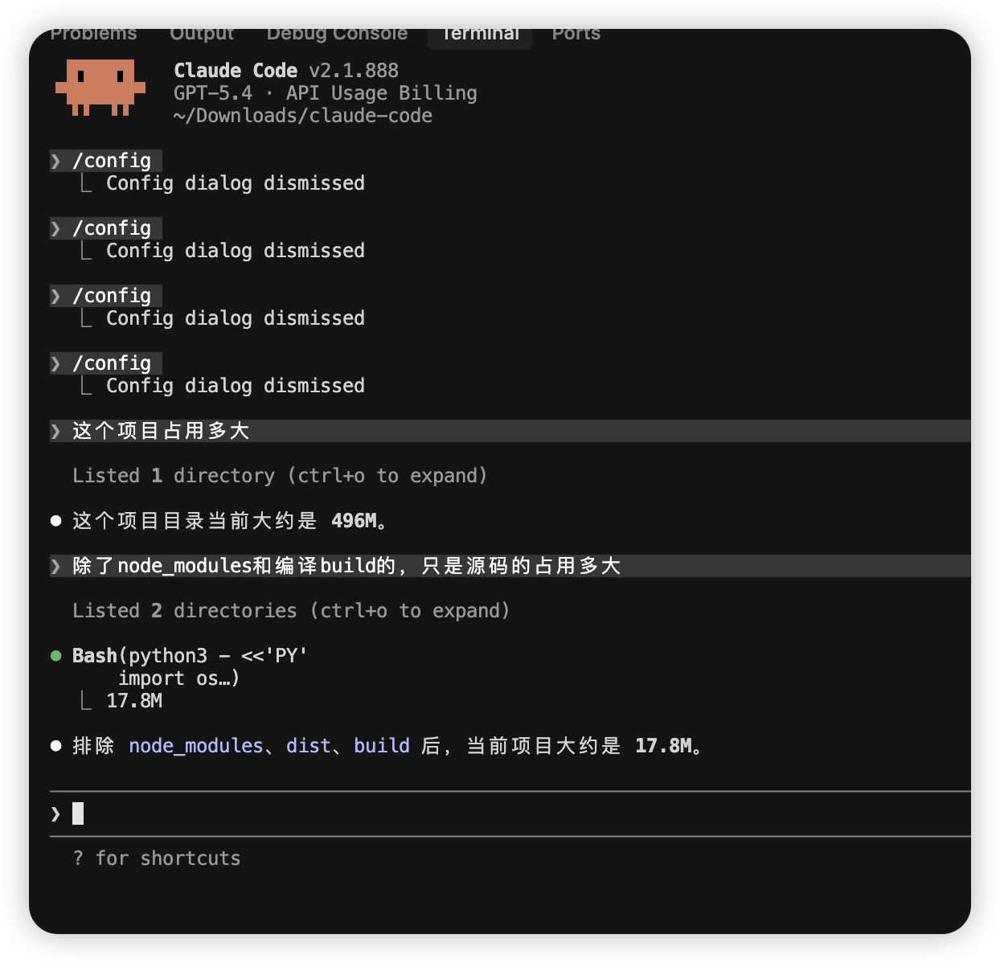
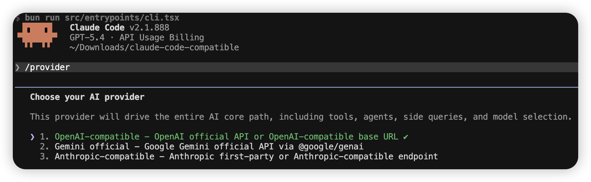

# Claude Code Compatible

<p align="center">
  
</p>

<p align="center">
  
</p>

This project further refines the Claude Code compatibility path for Bun.

Main focus:

- removes region and network restrictions by supporting custom compatible gateways and multi-provider routing
- compatible with `OpenAI-compatible` APIs
- compatible with `Gemini` APIs
- supports `Anthropic-compatible` endpoints

> [!WARNING]
> This repository is unofficial and is not affiliated with Anthropic. It is a reverse-engineered / decompiled compatibility project.

## Provider Compatibility

- `OpenAI-compatible`
- `Gemini`
- `Anthropic-compatible`
- `AWS Bedrock`
- `Google Vertex AI`
- `Azure AI Foundry`

The most important additions are `OpenAI-compatible` and `Gemini` support.

You can use official APIs, self-hosted compatible gateways, or provider proxies through configurable base URLs and provider routing, which makes the project much easier to use in restricted regions or unstable network environments.

## Quick Start

### 1. Install Node.js and npm

Choose one of the following:

- macOS: install from [nodejs.org](https://nodejs.org/) or use `brew install node`
- Windows: install from [nodejs.org](https://nodejs.org/)
- Linux: install from [nodejs.org](https://nodejs.org/) or use your distro package manager

Check that `node` and `npm` are available:

```bash
node -v
npm -v
```

### 2. Install Bun

```bash
npm install -g bun
```

Check Bun:

```bash
bun -v
```

Recommended version: [Bun](https://bun.sh/) `>= 1.3.11`

### 3. Install project dependencies

```bash
bun install
```

### 4. Run the project

```bash
bun run dev
```

### 5. Build

```bash
bun run build
```

## Provider Setup

```text
/provider
```

- Anthropic-compatible
- OpenAI-compatible
- Gemini

Advanced backends are also supported through environment configuration:

- `CLAUDE_CODE_USE_BEDROCK=1`
- `CLAUDE_CODE_USE_VERTEX=1`
- `CLAUDE_CODE_USE_FOUNDRY=1`

## Contributing

Issues are welcome. See [`CONTRIBUTING.md`](./CONTRIBUTING.md).

## Security

See [`SECURITY.md`](./SECURITY.md).

## Legal

See [`LEGAL.md`](./LEGAL.md).

## Contact

- `lonely121522521@gmail.com`

Five years of AI development experience. Happy to collaborate with other builders on compatible provider support and related engineering work.
